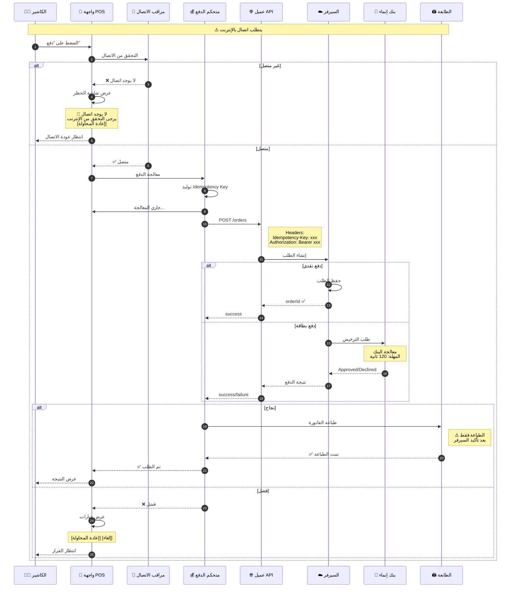
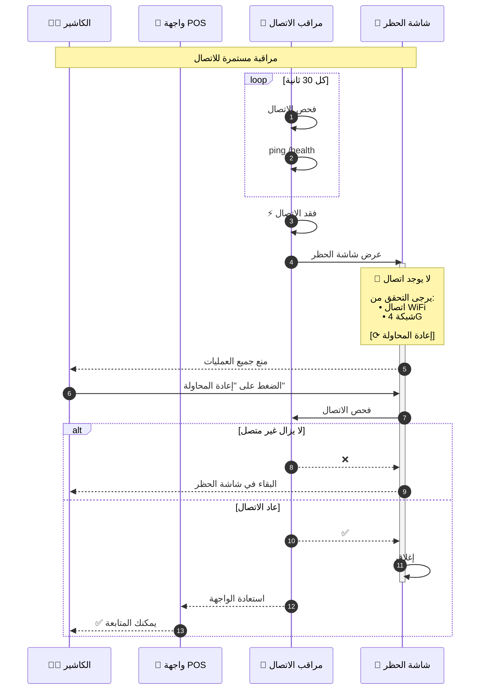
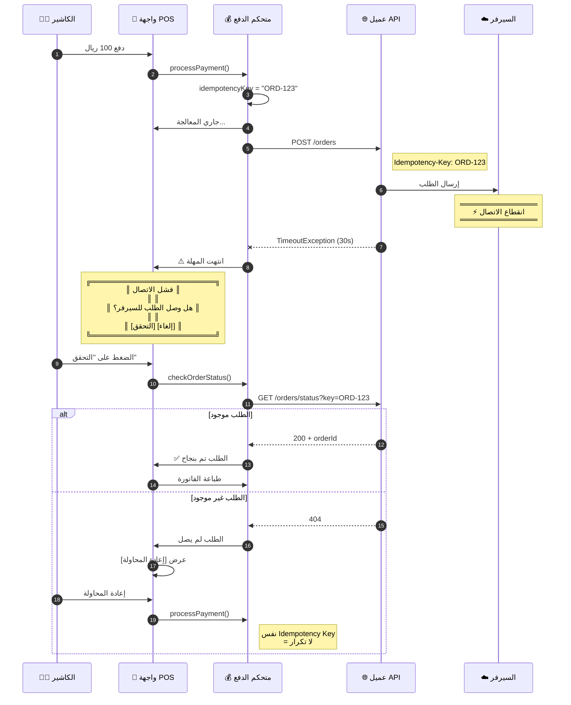
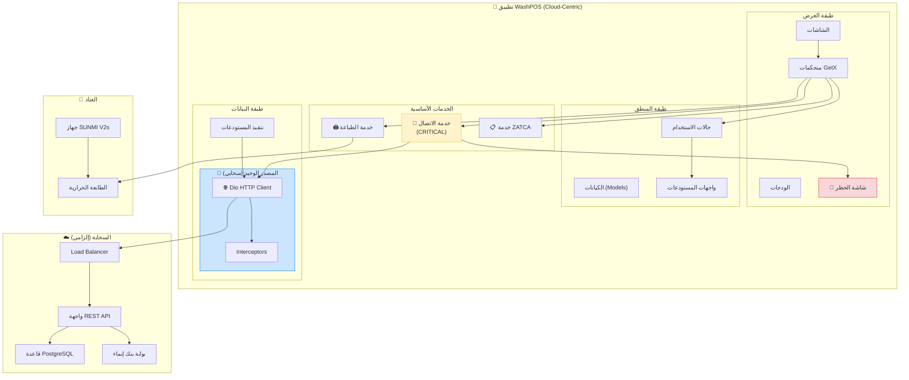
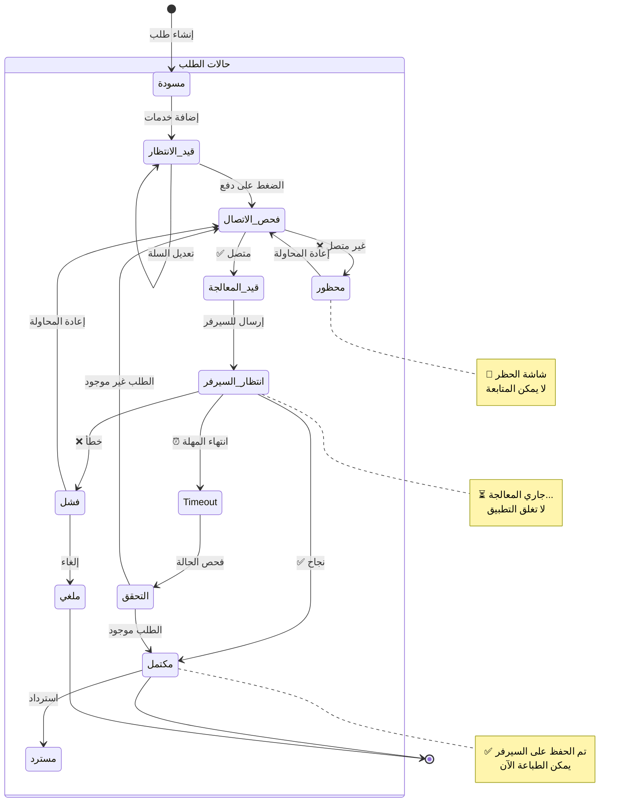
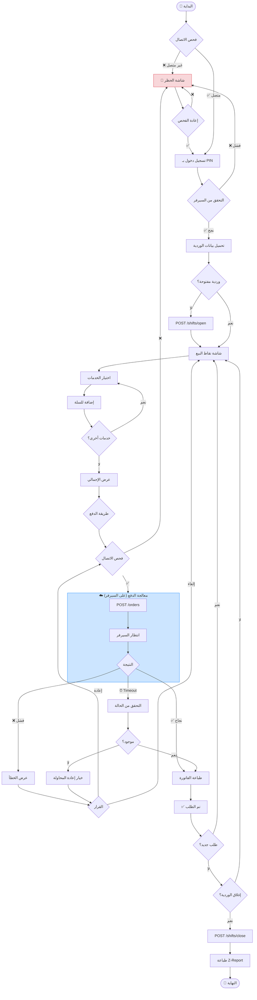
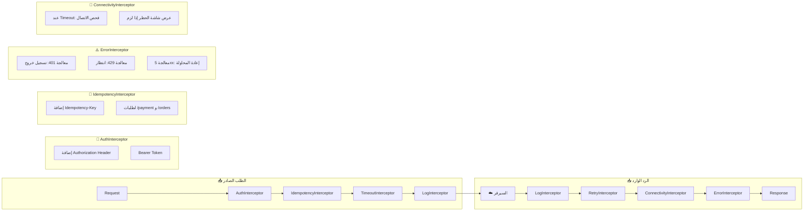
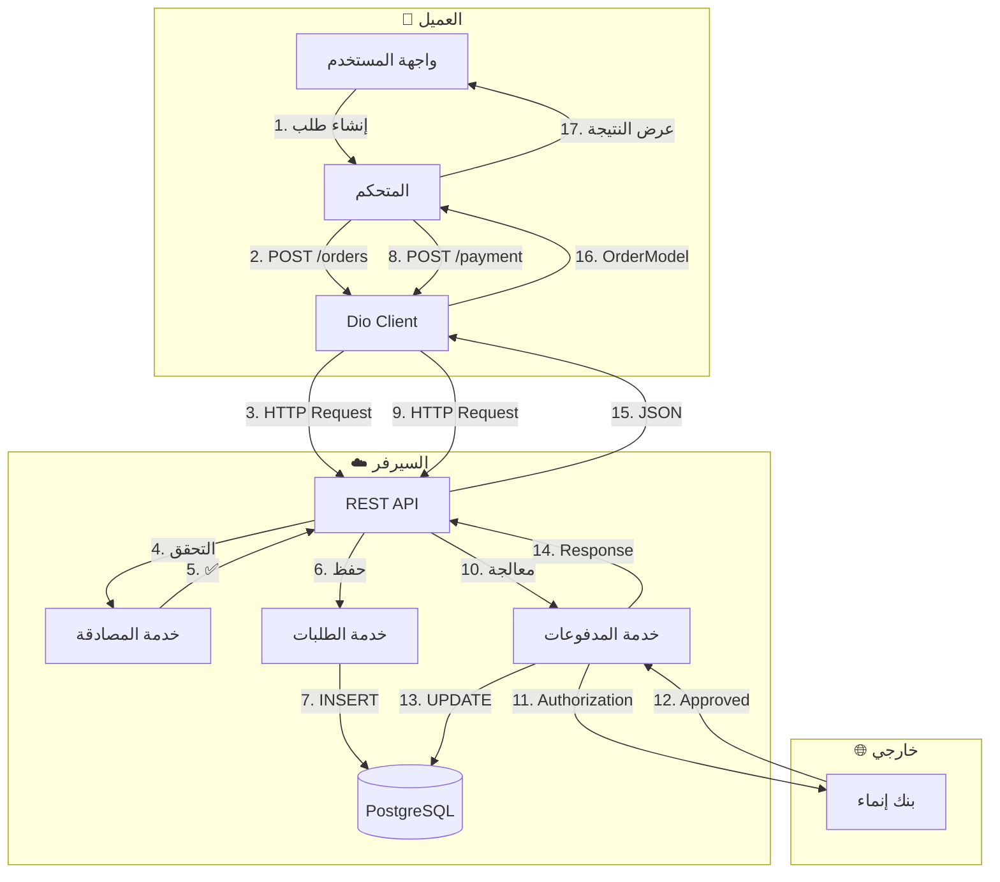

# 📐 مخططات UML - السيناريو الثاني

## نظام WashPOS بهيكلية Cloud-Centric

---

> [!CAUTION]
> هذه المخططات خاصة بالسيناريو الثاني (Cloud-Centric) مع التركيز على:
>
> - الاتصال الإلزامي بالإنترنت
> - عدم وجود قاعدة بيانات محلية
> - المعالجة الفورية على السيرفر

---

## 1. مخطط التسلسل - الدفع (يتطلب إنترنت دائماً)



---

## 2. مخطط التسلسل - معالجة انقطاع الاتصال



---

## 3. مخطط التسلسل - معالجة Timeout



---

## 4. مخطط المكونات - بنية Cloud-Centric



---

## 5. مخطط الحالة - حالات الطلب



---

## 6. مخطط الحالة - حالات الاتصال

```mermaid
stateDiagram-v2
    [*] --> جاري_الفحص: بدء التطبيق

    state "حالات الاتصال" as ConnStates {
        جاري_الفحص --> متصل: ✅ ping نجح
        جاري_الفحص --> غير_متصل: ❌ ping فشل

        متصل --> غير_متصل: فقد الاتصال
        غير_متصل --> جاري_الفحص: إعادة المحاولة

        متصل --> متصل: ping كل 30 ثانية
    end

    state "تأثير على الواجهة" as UIEffect {
        واجهة_عادية
        شاشة_حظر
    }

    متصل --> واجهة_عادية
    غير_متصل --> شاشة_حظر

    note right of متصل
        🟢 جميع العمليات متاحة
    end note

    note right of غير_متصل
        🔴 جميع العمليات محظورة
        حتى الدفع النقدي!
    end note
```

---

## 7. مخطط النشاط - تدفق العمل الكامل



---

## 8. مخطط Dio Interceptors



---

## 9. مخطط تدفق البيانات



---

## ملخص السيناريو الثاني

| الميزة             | الوصف                 |
| ------------------ | --------------------- |
| **قاعدة البيانات** | لا يوجد (السيرفر فقط) |
| **الدفع النقدي**   | ⚠️ يتطلب إنترنت       |
| **الدفع بالبطاقة** | ⚠️ يتطلب إنترنت       |
| **المزامنة**       | فورية (Real-time)     |
| **شاشة الحظر**     | ✅ عند فقد الاتصال    |
| **الموثوقية**      | تعتمد على الشبكة      |

---

## ⚠️ تحذيرات هامة

> [!CAUTION] > **هذا السيناريو لا يناسب:**
>
> - المغاسل في مواقف سفلية (Basements)
> - المناطق ذات الشبكة الضعيفة
> - المناطق الريفية
> - أي موقع قد ينقطع فيه الإنترنت بشكل متكرر
