# 📐 مخططات UML لنظام WashPOS

## نظام نقاط البيع للمغاسل

---

> [!NOTE]
> المخططات التالية مرسومة باستخدام Mermaid وتغطي كلا السيناريوهين

---

## 1. مخطط حالات الاستخدام (Use Case Diagram)

```mermaid
flowchart TB
    subgraph Actors["الجهات الفاعلة"]
        Cashier["🧑‍💼 الكاشير"]
        Supervisor["👨‍💻 المشرف"]
        Admin["👔 المدير"]
        Customer["👤 العميل"]
    end

    subgraph POS["نظام نقاط البيع"]
        UC1["إنشاء طلب جديد"]
        UC2["إضافة خدمات للسلة"]
        UC3["الدفع النقدي"]
        UC4["الدفع بالبطاقة"]
        UC5["طباعة الفاتورة"]
        UC6["تسجيل عميل جديد"]
        UC7["تطبيق برنامج الولاء"]
    end

    subgraph Shift["إدارة الورديات"]
        UC8["فتح الوردية"]
        UC9["إغلاق الوردية"]
        UC10["مطابقة الصندوق"]
        UC11["طباعة X-Report"]
        UC12["طباعة Z-Report"]
    end

    subgraph Admin_Panel["لوحة الإدارة"]
        UC13["إدارة الخدمات"]
        UC14["إدارة الموظفين"]
        UC15["عرض التقارير"]
        UC16["إدارة الأسعار"]
    end

    Cashier --> UC1
    Cashier --> UC2
    Cashier --> UC3
    Cashier --> UC4
    Cashier --> UC5
    Cashier --> UC6
    Cashier --> UC7

    Supervisor --> UC8
    Supervisor --> UC9
    Supervisor --> UC10
    Supervisor --> UC11
    Supervisor --> UC12
    Supervisor --> UC3
    Supervisor --> UC4

    Admin --> UC13
    Admin --> UC14
    Admin --> UC15
    Admin --> UC16

    Customer -.-> UC3
    Customer -.-> UC4
```

---

## 2. مخطط الفئات (Class Diagram)

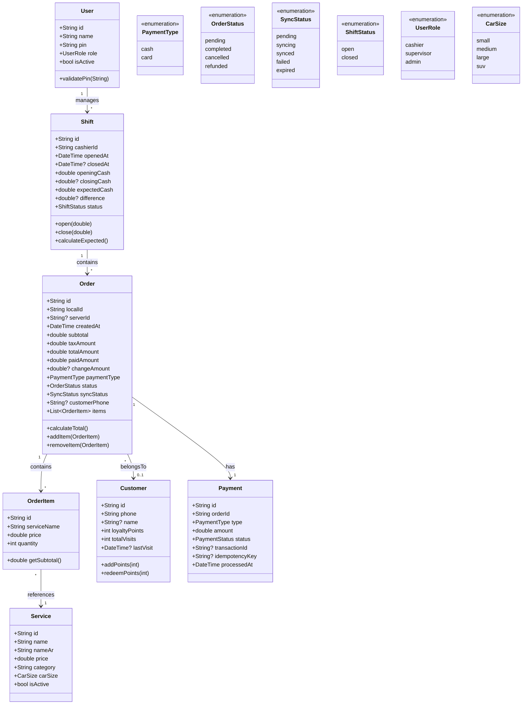

---

## 3. مخطط التسلسل - الدفع النقدي (Sequence Diagram - Cash Payment)

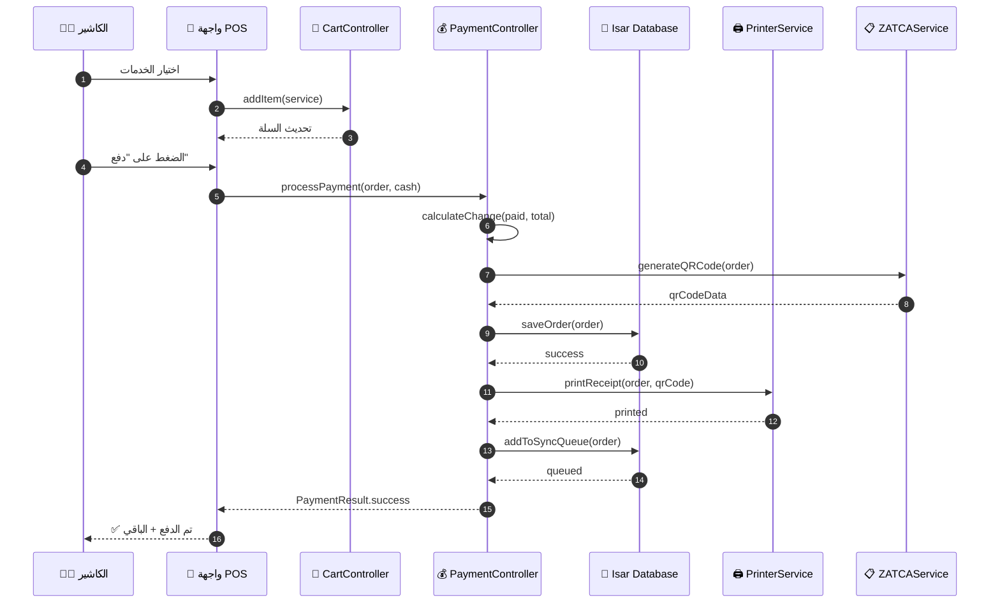

---

## 4. مخطط التسلسل - الدفع بالبطاقة (Sequence Diagram - Card Payment)

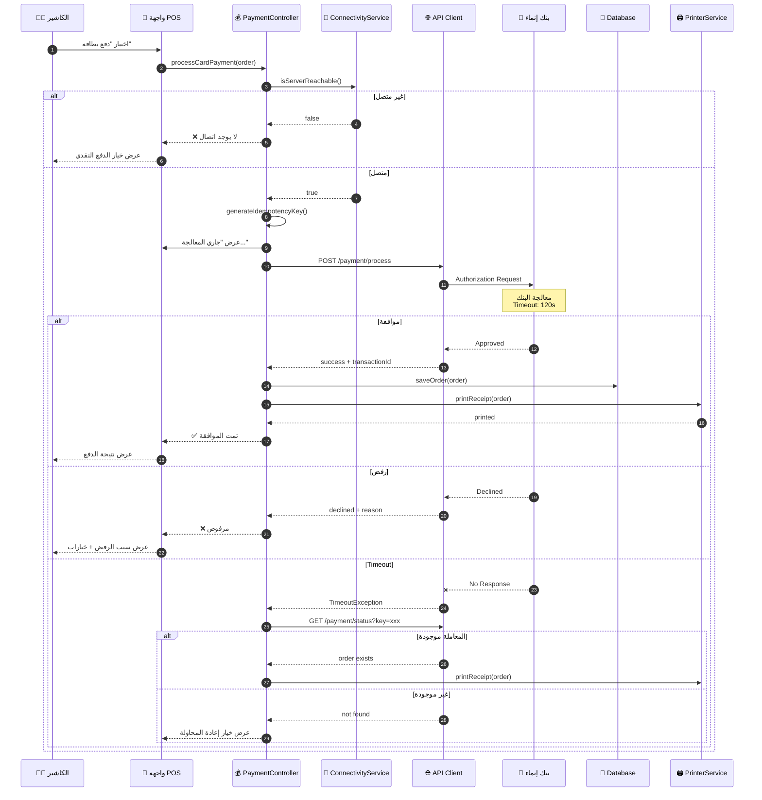

---

## 5. مخطط التسلسل - المزامنة (Sequence Diagram - Sync Worker)

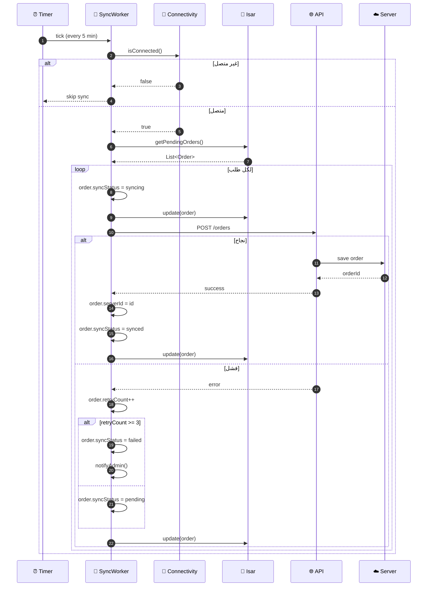

---

## 6. مخطط النشاط - إنشاء طلب (Activity Diagram - Create Order)

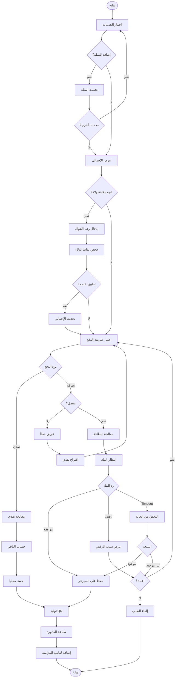

---

## 7. مخطط النشاط - إدارة الوردية (Activity Diagram - Shift Management)

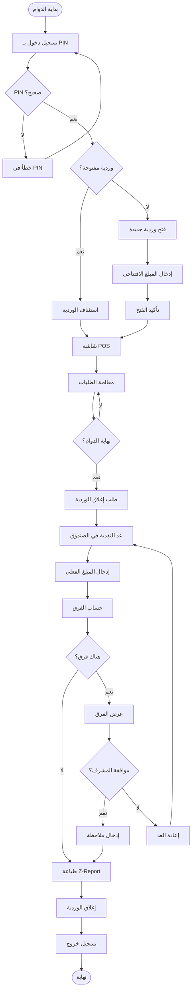

---

## 8. مخطط المكونات (Component Diagram)

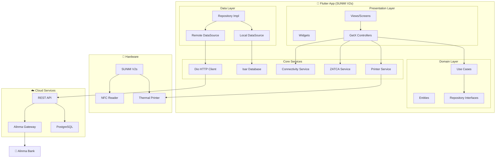

---

## 9. مخطط الحالة - حالات الطلب (State Diagram - Order States)

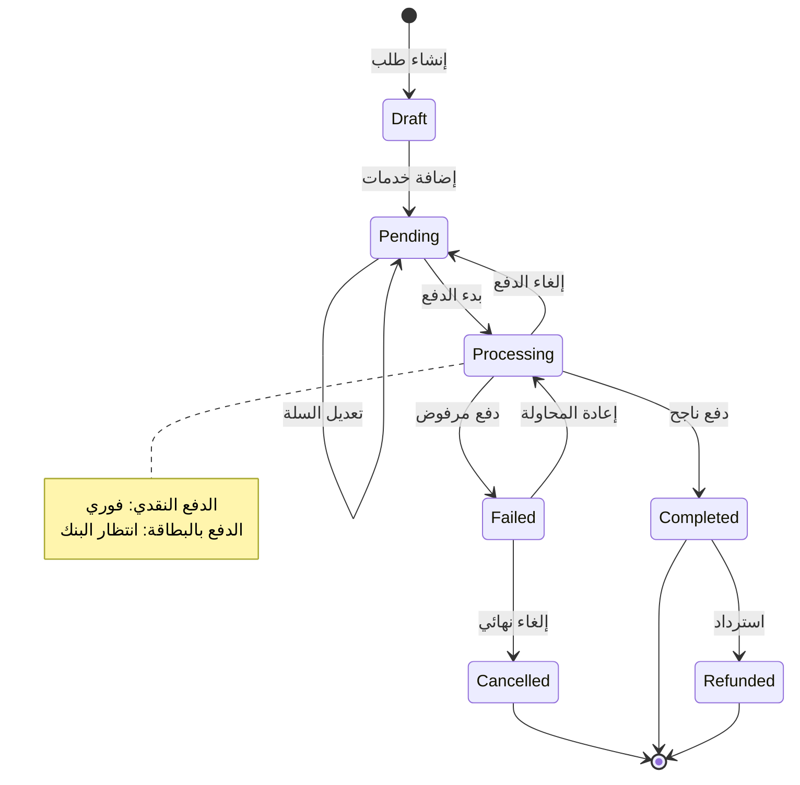

---

## 10. مخطط الحالة - حالات المزامنة (State Diagram - Sync States)

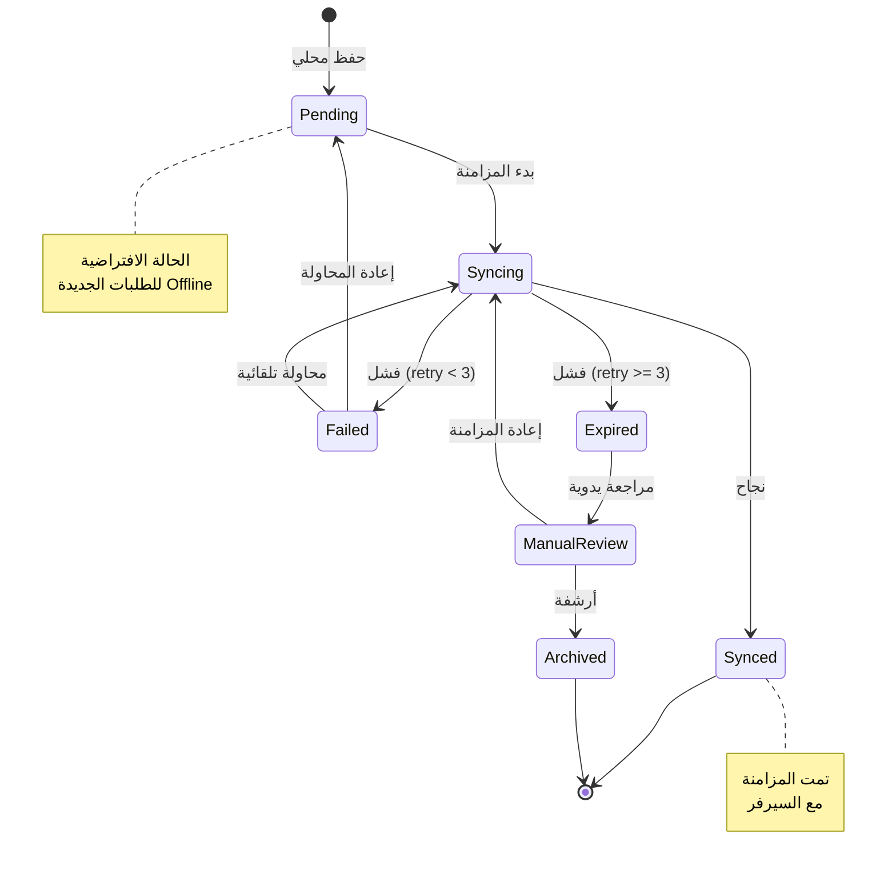

---

## 11. مخطط التوزيع (Deployment Diagram)

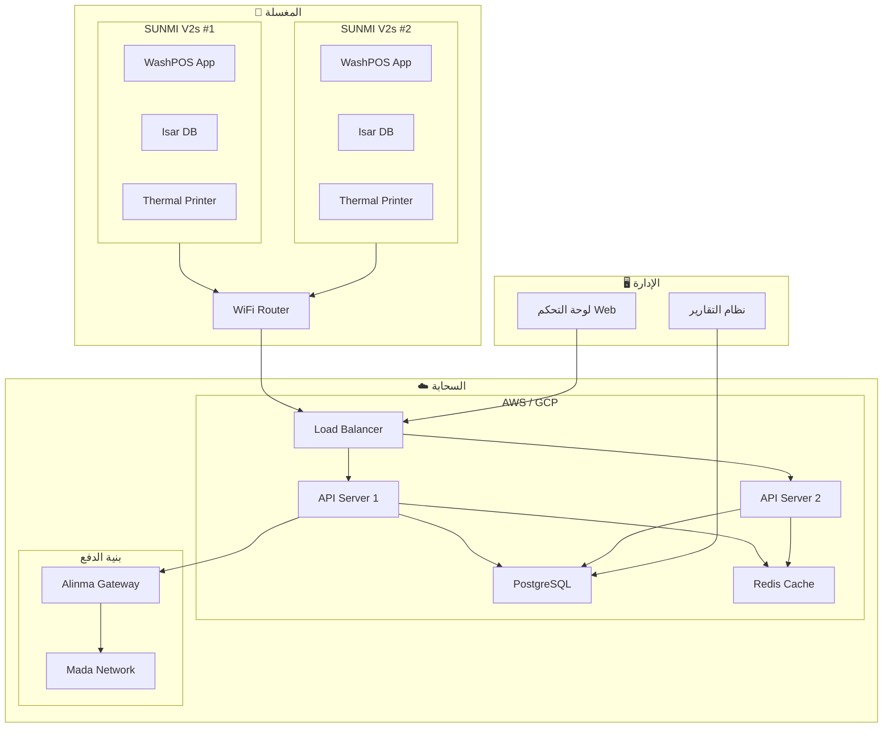

---

## 12. مخطط ERD (Entity Relationship Diagram)

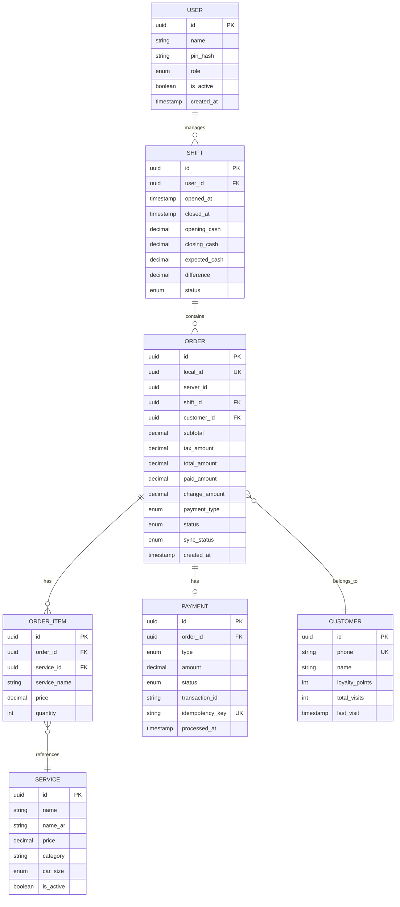

---

## ملخص المخططات

| #   | المخطط           | الوصف                           |
| --- | ---------------- | ------------------------------- |
| 1   | Use Case         | الجهات الفاعلة وحالات الاستخدام |
| 2   | Class            | الفئات والعلاقات                |
| 3   | Sequence (Cash)  | تسلسل الدفع النقدي              |
| 4   | Sequence (Card)  | تسلسل الدفع بالبطاقة            |
| 5   | Sequence (Sync)  | تسلسل المزامنة                  |
| 6   | Activity (Order) | نشاط إنشاء الطلب                |
| 7   | Activity (Shift) | نشاط إدارة الوردية              |
| 8   | Component        | مكونات النظام                   |
| 9   | State (Order)    | حالات الطلب                     |
| 10  | State (Sync)     | حالات المزامنة                  |
| 11  | Deployment       | توزيع النظام                    |
| 12  | ERD              | قاعدة البيانات                  |
