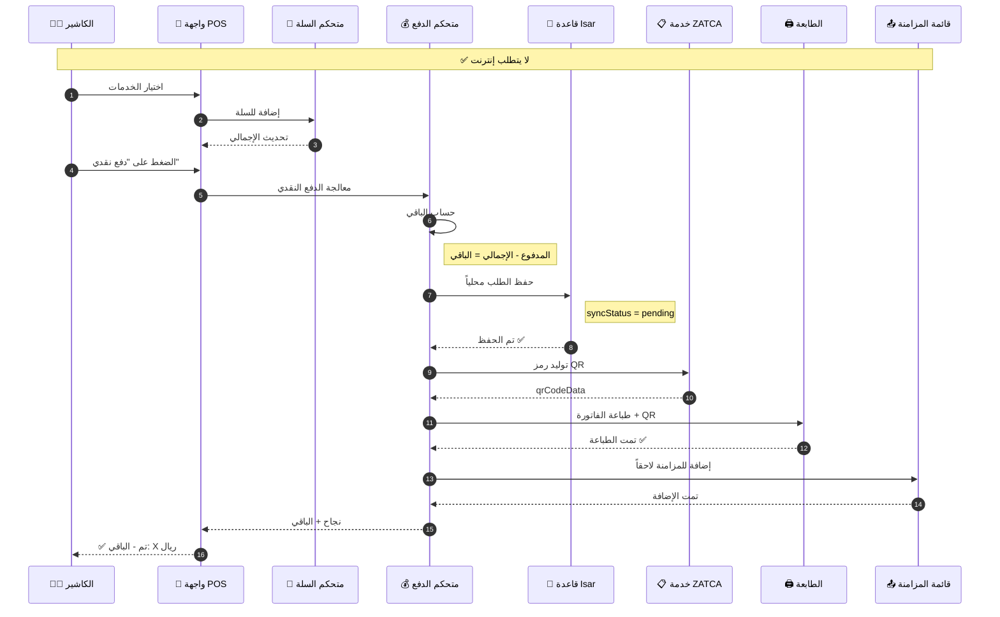
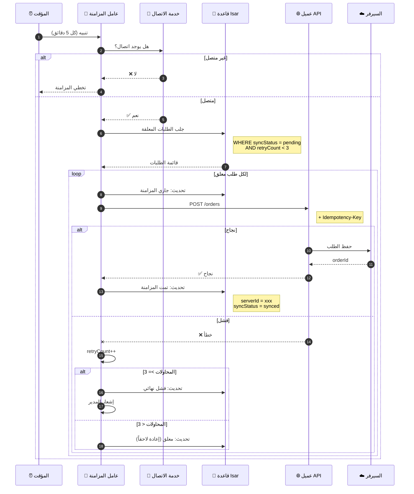
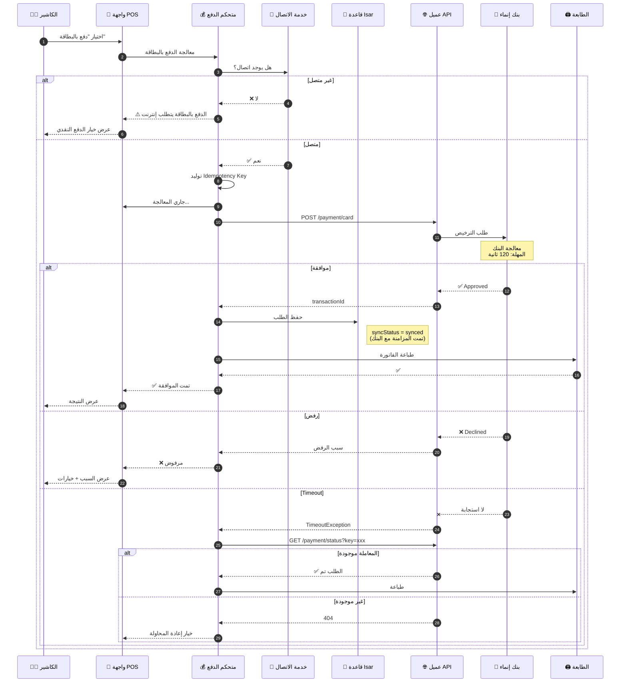
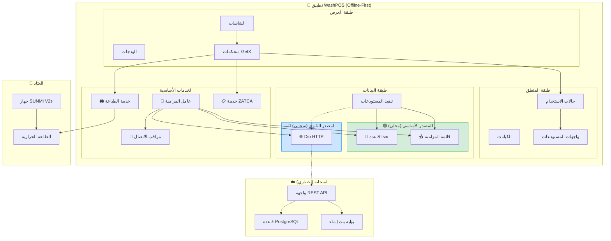
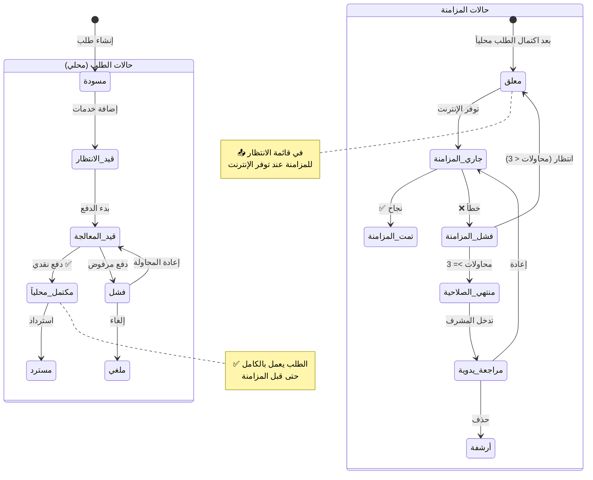
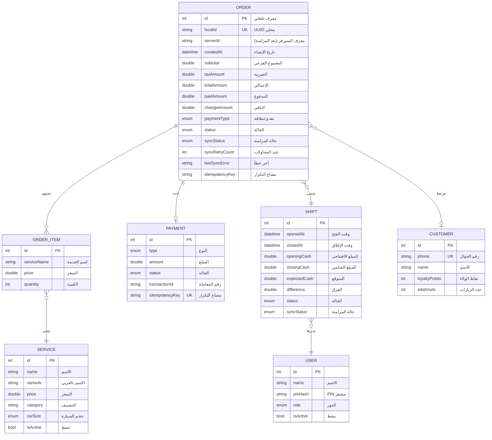

# 📐 مخططات UML - السيناريو الأول

## نظام WashPOS بهيكلية Offline-First

---

> [!NOTE]
> هذه المخططات خاصة بالسيناريو الأول (Offline-First) مع التركيز على:
>
> - قاعدة بيانات Isar المحلية
> - المزامنة الخلفية
> - العمل بدون إنترنت

---

## 1. مخطط التسلسل - الدفع النقدي (Offline)



---

## 2. مخطط التسلسل - المزامنة الخلفية (Sync Worker)



---

## 3. مخطط التسلسل - الدفع بالبطاقة (يتطلب إنترنت)



---

## 4. مخطط المكونات - بنية Offline-First



---

## 5. مخطط الحالة - حالات الطلب والمزامنة



---

## 6. مخطط النشاط - تدفق العمل الكامل

```mermaid
flowchart TD
    Start([🚀 البداية]) --> Login[تسجيل دخول بـ PIN]
    Login --> OpenShift{وردية مفتوحة؟}

    OpenShift -->|لا| EnterCash[إدخال المبلغ الافتتاحي]
    EnterCash --> CreateShift[فتح الوردية في Isar]
    CreateShift --> POSScreen

    OpenShift -->|نعم| POSScreen[شاشة نقاط البيع]

    POSScreen --> SelectServices[اختيار الخدمات]
    SelectServices --> AddToCart[إضافة للسلة]
    AddToCart --> More{خدمات أخرى؟}

    More -->|نعم| SelectServices
    More -->|لا| ShowTotal[عرض الإجمالي + الضريبة]

    ShowTotal --> PayMethod{طريقة الدفع}

    PayMethod -->|نقدي| CashFlow
    PayMethod -->|بطاقة| CardFlow

    subgraph CashFlow["💵 الدفع النقدي (Offline)"]
        EnterPaid[إدخال المبلغ المدفوع]
        CalcChange[حساب الباقي]
        SaveIsar[حفظ في Isar]
        GenQR[توليد QR]
        PrintReceipt[طباعة الفاتورة]
        AddQueue[إضافة لقائمة المزامنة]

        EnterPaid --> CalcChange
        CalcChange --> SaveIsar
        SaveIsar --> GenQR
        GenQR --> PrintReceipt
        PrintReceipt --> AddQueue
    end

    subgraph CardFlow["💳 الدفع بالبطاقة (Online)"]
        CheckConn{متصل؟}
        ShowError[⚠️ يتطلب إنترنت]
        ProcessCard[معالجة البطاقة]
        WaitBank[انتظار البنك]
        BankResult{النتيجة}
        SaveSynced[حفظ (تمت المزامنة)]
        ShowDecline[عرض سبب الرفض]

        CheckConn -->|لا| ShowError
        ShowError --> PayMethod
        CheckConn -->|نعم| ProcessCard
        ProcessCard --> WaitBank
        WaitBank --> BankResult
        BankResult -->|موافقة| SaveSynced
        BankResult -->|رفض| ShowDecline
        ShowDecline --> PayMethod
    end

    AddQueue --> Success[✅ تم الطلب]
    SaveSynced --> PrintReceipt2[طباعة الفاتورة]
    PrintReceipt2 --> Success

    Success --> NewOrder{طلب جديد؟}
    NewOrder -->|نعم| POSScreen
    NewOrder -->|لا| EndShift{إغلاق الوردية؟}

    EndShift -->|لا| POSScreen
    EndShift -->|نعم| CountCash[عد الصندوق]
    CountCash --> Reconcile[مطابقة]
    Reconcile --> PrintZReport[طباعة Z-Report]
    PrintZReport --> CloseShift[إغلاق الوردية]
    CloseShift --> End([🏁 النهاية])

    style CashFlow fill:#d4edda,stroke:#28a745
    style CardFlow fill:#fff3cd,stroke:#ffc107
```

---

## 7. مخطط ERD - قاعدة بيانات Isar المحلية



---

## ملخص السيناريو الأول

| الميزة             | الوصف              |
| ------------------ | ------------------ |
| **قاعدة البيانات** | Isar (محلية أولاً) |
| **الدفع النقدي**   | ✅ يعمل Offline    |
| **الدفع بالبطاقة** | ⚠️ يتطلب إنترنت    |
| **المزامنة**       | خلفية (كل 5 دقائق) |
| **حل التعارضات**   | Last Write Wins    |
| **الموثوقية**      | عالية جداً         |
